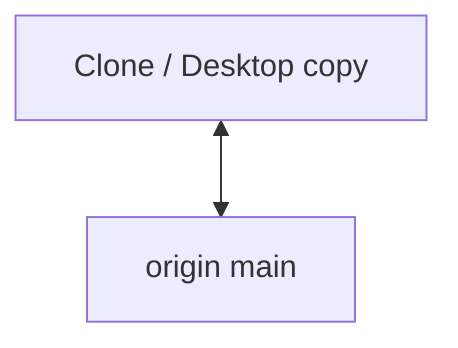

# PROJECT TECHNICAL OVERVIEW

> Last updated: 2026-04-22  
> Maintained by Cursor AI (updates after every meaningful change)

## 1. Project Overview
- **Purpose:** Placeholder; repository is bootstrapped with `LICENSE` only as of 2026-04-22.
- **Goals & Scope:** TBD; see @learnings.md for decisions.
- **Key Stakeholders / Users:** TBD

## 2. Tech Stack
- **Languages:** TBD
- **Frameworks / Libraries:** TBD
- **Databases / Storage:** TBD
- **Infrastructure / Hosting:** GitHub (`myceldigital/mythos-harness`, private)
- **Other Tools:** TBD

## 3. High-Level Architecture
- Standalone repository; no application code yet.
- **Core components:** (none yet)
- **Data flow:** N/A
- **Key design decisions:** Cross-reference @learnings.md

