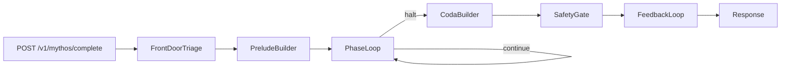

# PROJECT TECHNICAL OVERVIEW

> Last updated: 2026-04-22  
> Maintained by Cursor AI (updates after every meaningful change)

## 1. Project Overview
- **Purpose**: Mythos Harness provides a v0.3 orchestration runtime for complex completion tasks with explicit phase control, branching hypotheses, governed feedback logging, and a first-class chat web console.
- **Goals & Scope**: Ship a production-shaped scaffold that is runnable locally and extensible to real providers/stores without changing domain logic.
- **Key Stakeholders / Users**: Application engineers integrating `/v1/mythos/complete`, platform engineers swapping in production adapters, and researchers iterating reasoning policies.

## 2. Tech Stack
- **Languages**: Python 3.10+
- **Frameworks / Libraries**: FastAPI, LangGraph, Pydantic, pydantic-settings, httpx, asyncpg, redis, prometheus-client
- **Databases / Storage**: Memory/file defaults with production adapters for Postgres+pgvector, HTTP policy DB, and HTTP/Postgres trajectory sinks
- **Infrastructure / Hosting**: ASGI service via uvicorn; repository hosted in GitHub
- **Other Tools**: pytest, justfile task runner, compileall lint sanity pass

## 3. High-Level Architecture
- **Style**: Modular service with explicit orchestration graph
- **Core Components**:
  - API layer (`mythos_harness.api`)
  - Orchestrator composition (`mythos_harness.core.service`)
  - Structured state and phase loop (`mythos_harness.core.*`)
  - LangGraph topology (`mythos_harness.graph.builder`)
  - Provider abstraction (`mythos_harness.providers.*`)
  - Storage adapters (`mythos_harness.storage.*`)
- **Key Design Decisions**: See `@learnings.md` for rationale behind phase-keyed looping, safety placement, and feedback governance.

## 4. Source Tree Blueprint
- `src/mythos_harness/main.py`: App bootstrap, dependency wiring, health endpoint.
- `src/mythos_harness/api/router.py`: REST entrypoint and response shaping, including SSE stream endpoint for progressive answers.
- `src/mythos_harness/core/state.py`: Structured latent schema + runtime state machine fields.
- `src/mythos_harness/core/triage.py`: Front-door classification and execution-mode estimation.
- `src/mythos_harness/core/branch_manager.py`: Hypothesis branching, pruning, and collapse.
- `src/mythos_harness/core/loop.py`: Phase handlers and deterministic convergence checks.
- `src/mythos_harness/core/coda.py`: Best-state selection and confidence/citation framing.
- `src/mythos_harness/core/safety.py`: Post-coda policy gate and revision path.
- `src/mythos_harness/core/feedback.py`: Passive trajectory logger.
- `src/mythos_harness/graph/builder.py`: LangGraph assembly and loop routing.
- `src/mythos_harness/providers/factory.py`: Provider backend selection (`local`, `openai_compatible`, `openrouter`) + judge override.
- `src/mythos_harness/providers/openai_compatible.py`: API-key based chat completion adapter for OpenAI-compatible APIs, including SSE token streaming support.
- `src/mythos_harness/providers/routed.py`: Model-role routing (judge model can use separate provider family).
- `src/mythos_harness/embeddings/factory.py`: Embedding backend selection (`local`, `openai_compatible`, `openrouter`).
- `src/mythos_harness/embeddings/openai_compatible.py`: API-key based embedding adapter.
- `src/mythos_harness/api/middleware.py`: API key auth + pluggable rate-limit middleware (memory/redis).
- `src/mythos_harness/api/observability.py`: request IDs, structured access logs, and Prometheus metrics wiring.
- `src/mythos_harness/web/index.html`: primary chat UI shell served at `/app`.
- `src/mythos_harness/web/static/app.css`: premium responsive design system (security notice, status badge, tabbed insights, telemetry cards, activity styling).
- `src/mythos_harness/web/static/app.js`: session management, API requests, connection testing, request payload preview, constraints/execution-mode controls, and activity event feed.
- `src/mythos_harness/storage/factory.py`: Session/policy/trajectory backend selection.
- `scripts/apply_migrations.py`: idempotent SQL migration runner with checksum tracking.
- `sql/bootstrap_postgres.sql`: pgvector/Postgres schema bootstrap for externalized state and trajectories.
- `sql/migrations/20260422_vector_16_to_1536.sql`: safe migration path for legacy vector dimensions.
- `tests/`: Unit/smoke tests for state, triage, branch manager, and API route.

## 5. Runtime Flow
1. Request arrives with `query`, optional `thread_id`, optional constraints.
2. Front-door triage scores complexity/risk and picks an execution mode.
3. Prelude seeds encoded input, beta latent, and initial hypothesis/facts.
4. Session fetch stage loads same-thread snapshot and similarity-ranked memories from session store.
5. Phase loop iterates through explore/solve/verify/repair/synthesize until deterministic halt conditions are met.
6. Coda synthesizes winner and calibrates confidence.
7. Safety gate applies policy lookup and optional revision.
8. Feedback loop writes trajectory record for offline evaluation workflows.
9. Middleware stack adds request IDs, access logs, auth/rate-limit checks, and metrics instrumentation.
10. Web console at `/app` drives interactive usage and calls `/v1/mythos/complete`.
11. Streaming-capable clients can call `/v1/mythos/stream` and consume SSE events (`status`, `token`, `replace`, `final`, `done`) for progressive rendering.

## 6. Config & Operations
- Environment variables use `MYTHOS_` prefix (`.env.example` included).
- User-facing endpoints:
  - `/app` interactive chat console
  - `/app/static/*` web assets
  - `POST /v1/mythos/complete` blocking JSON completion
  - `POST /v1/mythos/stream` SSE progressive completion
  - `/docs` OpenAPI UI
- `/app` UX capabilities:
  - persistent multi-session chat timeline mapped to `thread_id`
  - run configuration controls (API base URL, API key, execution mode hint, constraints JSON)
  - connection check against `/healthz` + `/readyz`
  - tabbed run insights (overview metrics, triage JSON, request payload, activity feed)
- Provider backends:
  - primary: `MYTHOS_PROVIDER_BACKEND=local|openai_compatible|openrouter`
  - optional judge override: `MYTHOS_JUDGE_PROVIDER_BACKEND=...`
- Embedding backend:
  - `MYTHOS_EMBEDDING_BACKEND=local|openai_compatible|openrouter`
  - `MYTHOS_EMBEDDING_MODEL=...`
  - optional key/base URL overrides: `MYTHOS_EMBEDDING_API_KEY`, `MYTHOS_EMBEDDING_BASE_URL`
- API middleware controls:
  - `MYTHOS_API_AUTH_ENABLED`, `MYTHOS_API_AUTH_KEYS`, `MYTHOS_API_AUTH_KEY_HASHES`
  - `MYTHOS_RATE_LIMIT_ENABLED`, `MYTHOS_RATE_LIMIT_REQUESTS`, `MYTHOS_RATE_LIMIT_WINDOW_S`, `MYTHOS_RATE_LIMIT_KEY_SOURCE`
  - `MYTHOS_RATE_LIMIT_BACKEND=memory|redis`, `MYTHOS_RATE_LIMIT_FAIL_OPEN`
  - `MYTHOS_REDIS_URL`, `MYTHOS_REDIS_PREFIX`
- Observability controls:
  - `MYTHOS_METRICS_ENABLED`, `MYTHOS_ACCESS_LOG_ENABLED`, `MYTHOS_REQUEST_ID_HEADER`, `MYTHOS_LOG_LEVEL`
- Retry/backoff controls:
  - `MYTHOS_RETRY_MAX_ATTEMPTS`, `MYTHOS_RETRY_BASE_DELAY_S`, `MYTHOS_RETRY_MAX_DELAY_S`, `MYTHOS_RETRY_JITTER_S`
- Memory similarity controls:
  - `MYTHOS_MEMORY_RETRIEVAL_K`
- Store backends:
  - `MYTHOS_SESSION_STORE_BACKEND=memory|postgres`
  - `MYTHOS_POLICY_STORE_BACKEND=file|http`
  - `MYTHOS_TRAJECTORY_STORE_BACKEND=jsonl|postgres|http`
- Postgres adapters require `MYTHOS_POSTGRES_DSN` and pgvector extension (`sql/bootstrap_postgres.sql`).
- `MYTHOS_PGVECTOR_DIMENSIONS` must match your selected embedding model dimension for production correctness.
- Use `sql/migrations/20260422_vector_16_to_1536.sql` for older installs with legacy `vector(16)` schemas.
- Use `scripts/apply_migrations.py` (or `just migrate`) to apply all pending SQL migrations with tracking.
- Default local paths:
  - trajectory log: `data/trajectories.jsonl`
  - policy file: `config/policy_rules.json`

## 7. Verification
- Install: `python3 -m pip install -e ".[dev]"`
- Tests: `python3 -m pytest -q`
- Lint sanity: `python3 -m compileall src`
