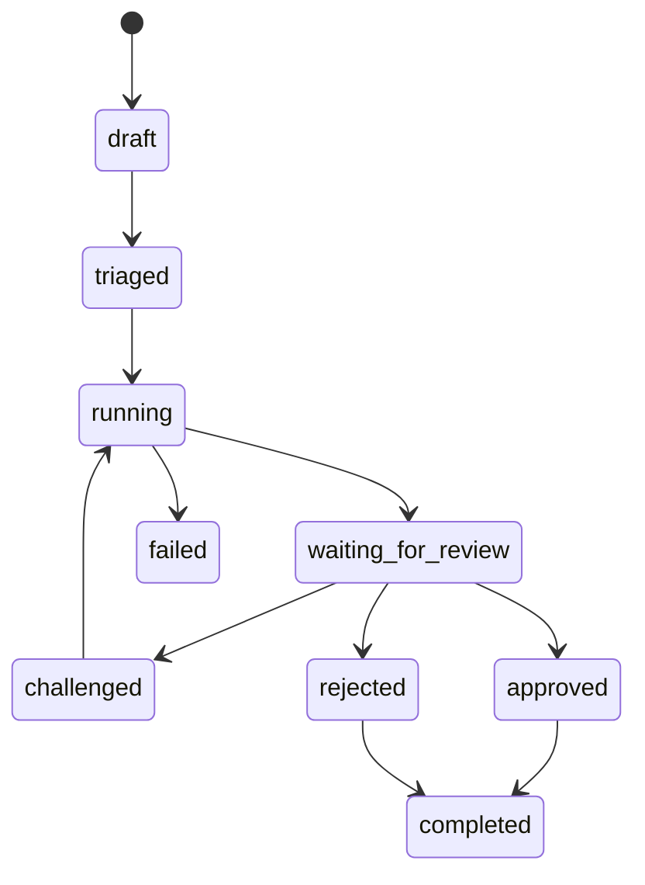

# DecisionRun Architecture

Mythos Harness is evolving from a completion runtime into a premium model harness for consequential decisions.

The key architectural shift is to make `DecisionRun` the durable unit of work.

Chat and completion APIs can remain convenient interfaces, but high-stakes work should be represented as a run with evidence, branches, assumptions, contradictions, budget, review status, trajectory metadata, and exportable artifacts.

## Why DecisionRun Exists

A raw model call has one dominant object: the prompt.

A high-stakes reasoning workflow needs richer objects:

- the decision question,
- the domain and risk profile,
- the admitted evidence,
- the branch strategy,
- the inference budget,
- the assumptions,
- the contradictions,
- the judge results,
- the recommendation,
- the human review trail,
- and the audit bundle.

`DecisionRun` is the container for those objects.

## Lifecycle



## Proposed Pipeline

```text
create DecisionRun
  -> classify domain, risk, ambiguity, and budget
  -> attach EvidencePack
  -> generate initial AssumptionLedger
  -> spawn expert-role branches
  -> retrieve evidence per branch
  -> argue branch cases
  -> cross-examine assumptions
  -> detect contradictions
  -> run judge pass
  -> repair weak reasoning
  -> calibrate confidence
  -> render DecisionMemo
  -> apply safety and policy gates
  -> create AuditBundle
  -> request human review
```

## Core Domain Objects

| Object | Purpose |
|---|---|
| `DecisionRun` | Durable high-stakes reasoning unit. |
| `EvidencePack` | Run-specific evidence room; distinct from session memory. |
| `EvidenceSource` | Document, URL, dataset, note, transcript, or other source. |
| `EvidenceClaim` | Small claim extracted from a source and used in branches/memos. |
| `DecisionBranch` | Named adversarial or constructive reasoning branch. |
| `Assumption` | Explicit assumption supporting or weakening the recommendation. |
| `Contradiction` | Conflict between claims, branches, or assumptions. |
| `InferenceBudget` | Token, cost, latency, and depth envelope for a run. |
| `DecisionMemo` | Board-grade final artifact. |
| `ApprovalRecord` | Human review event. |
| `AuditBundle` | Exportable record tying the run, evidence, memo, approvals, and trajectory together. |

## Expert Branches

Generic hypothesis branching is not enough for premium decision support.

Mythos should spawn named expert-role branches such as:

- `bull_case`,
- `bear_case`,
- `cfo_skeptic`,
- `legal_compliance_skeptic`,
- `clinical_skeptic`,
- `regulatory_skeptic`,
- `commercial_skeptic`,
- `attacker_modeler`,
- `containment_skeptic`.

The current scaffold exposes these in `mythos_harness.panels.expert_roles`.

## Evidence Packs vs Memory

Memory is what the system remembers from prior sessions.

Evidence is what the current decision is allowed to rely on.

For high-stakes runs, the model should prefer EvidencePack material over conversational memory. Future retrieval work should parse, chunk, classify, claim-extract, score, and cite evidence before it is allowed into a final memo.

## Budgeted Inference

A premium harness should not merely use more tokens.

It should allocate tokens where they increase expected decision quality.

`InferenceBudget` exists to track:

- maximum tokens,
- maximum cost,
- maximum latency,
- reasoning depth,
- escalation policy,
- spent tokens,
- spent cost,
- elapsed time.

Future orchestrator work should use this object to decide whether another branch, judge pass, or repair loop is worth the marginal cost.

## Near-Term Integration Plan

1. Add `/v1/decision-runs` API routes.
2. Persist `DecisionRun`, `EvidencePack`, and `AuditBundle` in Postgres.
3. Add a `decision_memo` execution mode to the existing orchestrator.
4. Use expert-role panels to seed branch manager hypotheses.
5. Emit `DecisionMemo` as a structured output artifact.
6. Add evals comparing direct base-model calls against Mythos decision runs.
7. Upgrade `/app` into a Decision Room view with branches, assumptions, contradictions, confidence, and audit export.
