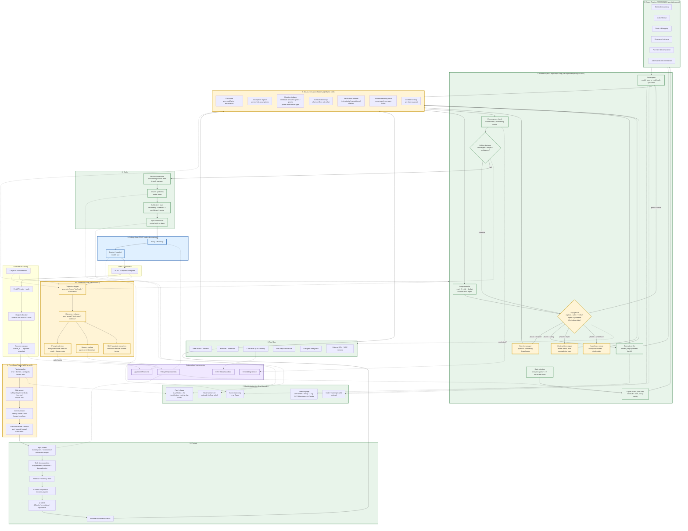

# Mythos Harness v0.3 — Full Synthesis

## Evolution

| Version  | Defining property                                                                                                 |
| -------- | ----------------------------------------------------------------------------------------------------------------- |
| **v0.1** | Single-file asyncio library. Architectural faithfulness, low production-readiness.                                |
| **v0.2** | FastAPI + LangGraph + external components (E2B, pgvector, external judge, policy DB). Corrected safety placement. |
| **v0.3** | Adds structured latent state, front-door triage, branch manager, phase-keyed loop, 5-model bus, feedback loop.    |

The alternative architecture brought three genuinely new ideas that neither v0.1 nor v0.2 had:

1. **Structured latent state** (the biggest architectural improvement in this thread)
2. **Branch manager** for competing hypotheses
3. **Feedback loop** for continuous improvement from trajectory logs

## v0.3 Architecture



## Key code deltas from v0.2 → v0.3

### Structured state (replacing `hidden_state: str`)

```python
@dataclass
class GroundedFact:
    claim: str
    source: str  # URL, tool output id, user input, etc.
    confidence: float
    loop_introduced: int

@dataclass
class Assumption:
    statement: str
    rationale: str
    resolved: bool = False
    resolution: Optional[str] = None

@dataclass
class Hypothesis:
    id: str
    answer: str
    reasoning_path: list[str]
    confidence: float
    contradictions: list[str] = field(default_factory=list)
    supporting_tests: list[str] = field(default_factory=list)
    alive: bool = True  # False if pruned by branch manager

@dataclass
class Contradiction:
    claim_a: str
    claim_b: str
    severity: float
    loop_detected: int

@dataclass
class VerificationArtifact:
    kind: str  # "test_result", "calculation", "citation", "tool_output"
    content: str
    passes: bool
    loop_produced: int

@dataclass
class StructuredState:
    facts: list[GroundedFact] = field(default_factory=list)
    assumptions: list[Assumption] = field(default_factory=list)
    hypotheses: list[Hypothesis] = field(default_factory=list)
    contradictions: list[Contradiction] = field(default_factory=list)
    artifacts: list[VerificationArtifact] = field(default_factory=list)
    trace: list[str] = field(default_factory=list)
    confidence_map: dict[str, float] = field(default_factory=dict)

    def active_hypotheses(self) -> list[Hypothesis]:
        return [h for h in self.hypotheses if h.alive]

    def should_branch(self) -> bool:
        top = self.active_hypotheses()
        if len(top) >= 3:
            return False  # already branched
        if any(c.severity > 0.6 for c in self.contradictions):
            return True
        if top and max(h.confidence for h in top) < 0.5:
            return True
        return False
```

### Branch manager

```python
class BranchManager:
    """Maintains N competing hypotheses. Spawns on low confidence, prunes on contradictions."""

    def __init__(self, max_branches: int = 3):
        self.max_branches = max_branches

    async def step(self, state: StructuredState, provider: ModelProvider) -> StructuredState:
        if state.should_branch() and len(state.active_hypotheses()) < self.max_branches:
            # Prompt the model to generate an alternative hypothesis
            new_hyp = await self._generate_alternative(state, provider)
            state.hypotheses.append(new_hyp)

        # Prune hypotheses with strong contradictions and low confidence
        for h in state.hypotheses:
            if h.confidence < 0.2 or len(h.contradictions) >= 3:
                h.alive = False

        return state

    async def collapse(self, state: StructuredState) -> Hypothesis:
        """Pick the winning hypothesis at synthesis time."""
        alive = state.active_hypotheses()
        if not alive:
            raise RuntimeError("No live hypotheses at collapse time")
        return max(alive, key=lambda h: h.confidence * (1 - 0.1 * len(h.contradictions)))
```

### Front-door triage (new node before prelude)

```python
class FrontDoorTriage:
    PROMPT = """Classify this request for triage. Return JSON:
- task_type: one of {default, math, code, literature, analysis, planning, factual}
- difficulty: 0-1
- ambiguity: 0-1
- risk_domain: null | legal | medical | financial | safety | cyber
- execution_mode: fast | normal | deep | exhaustive
- estimated_cost_tokens: int
- needs_tools: bool
- needs_retrieval: bool"""

    async def triage(self, query: str, provider: ModelProvider, config) -> dict:
        resp = await provider.complete(
            model=config.fast_model,
            messages=[{"role": "user", "content": f"{self.PROMPT}\n\nQUERY: {query}"}],
            max_tokens=400,
            temperature=0.1,
        )
        return _safe_json_parse(resp["content"], fallback={"execution_mode": "normal"})
```

### Feedback loop (logged async, applied with governance)

```python
class FeedbackLoop:
    """Async, non-blocking. Writes trajectories for later analysis.
    Prompt optimization NEVER applies automatically to production — requires held-out eval pass + human approval."""

    def __init__(self, storage):
        self.storage = storage

    async def log_trajectory(self, state: MythosState) -> str:
        trajectory_id = hashlib.sha256(state.query.encode()).hexdigest()[:12]
        await self.storage.write({
            "id": trajectory_id,
            "query": state.query,
            "final_answer": state.final_answer,
            "loops": state.loop_index,
            "halt_reason": state.halt_reason,
            "per_loop_metrics": state.per_loop_metrics,
            "structured_state": asdict(state.structured_state),
            "timestamp": datetime.utcnow().isoformat(),
        })
        return trajectory_id

    async def evaluate_batch(self, trajectory_ids: list[str]) -> dict:
        """Run offline. Evaluator model scores each trajectory.
        Outputs are reviewed before any prompt changes are applied."""
        # ... offline eval, not in the hot path
        pass
```

## Migration path v0.2 → v0.3 (ordered by value)

1. **Structured state** (1-2 days) — replace `hidden_state: str` with `StructuredState`. Update loop step prompts to write to the schema. Biggest single win.
2. **Front-door triage** (0.5 day) — new LangGraph node before prelude. Saves cost on easy queries.
3. **External judge with different model family** (0.5 day) — already flagged for v0.2, pulls through cleanly.
4. **5-model bus** (1 day) — add fast, judge, code/math, style to config. Wire to nodes.
5. **Phase-keyed loop states** (2-3 days) — explore/solve/verify/repair/synthesize as LangGraph nodes with conditional edges.
6. **Branch manager** (3-5 days) — harder than it looks because you need branch-local state + collapse logic.
7. **Calibration layer in coda** (1 day) — prompt that extracts uncertainty + citations into structured output.
8. **Feedback loop (passive)** (2 days) — just the trajectory logger and storage. No automated prompt modification.
9. **Feedback loop (active, gated)** (2-4 weeks) — outcome evaluator + prompt optimizer + held-out eval harness + human review gate. This is the hardest part and shouldn't be rushed.

## Panel closing verdict

v0.3 is the first version in this thread that's good enough to actually build. It inherits:

- Architectural faithfulness from v0.1
- Production shape from v0.2 (FastAPI + LangGraph + external components)
- Structured reasoning state from this alternative
- Branching topology from this alternative
- Continuous-improvement capability from this alternative

And avoids the repeated mistake all three alternative diagrams made: putting safety monitoring inside the reasoning loop.

**One cautionary note from V.:** The feedback loop is powerful and dangerous. Prompt optimization from usage data without governance = model behavior drift over time, often in directions you can't detect until a user files a complaint. Never apply optimizer output automatically to production. Always: held-out eval harness + human review + gradual rollout + rollback capability. Otherwise the harness becomes a slow-motion failure generator.
